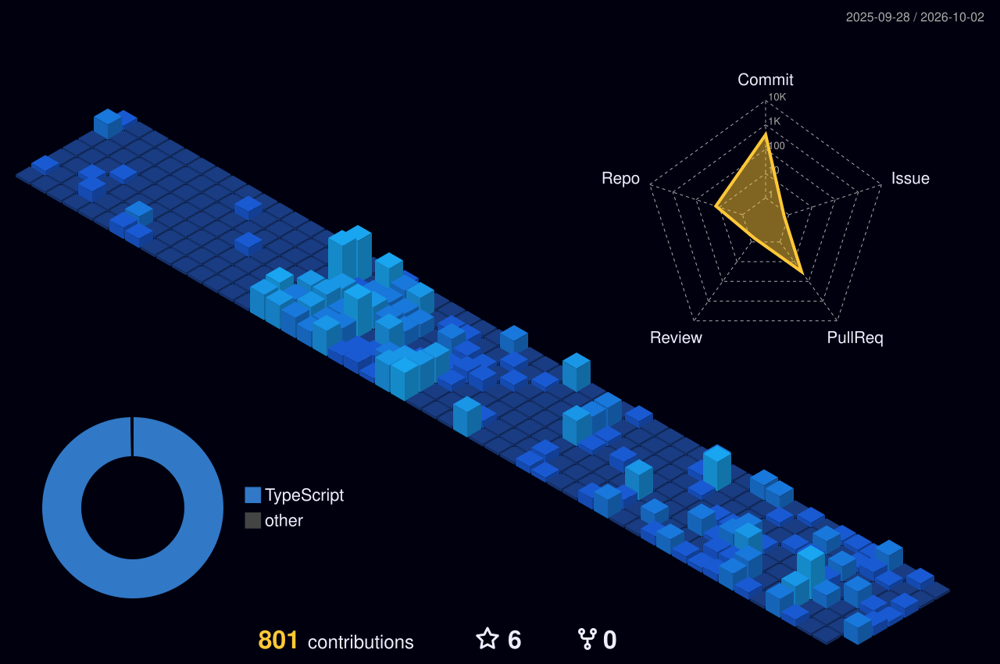

## ⭐ Featured builds

| Project | What it is | Stack | Stars |
|---|---|---|---|
| [**buildmyapp**](https://github.com/rohittrv7/buildmyapp) | Portfolio + custom app orders + downloadable software store | TypeScript |  |
| [**chatting-app**](https://github.com/rohittrv7/chatting-app) | Real-time messaging app (backend + mobile) | TypeScript |  |
| [**eduApp**](https://github.com/rohittrv7/eduApp) | Education app | TypeScript |  |
| [**digital-board**](https://github.com/rohittrv7/digital-board) | Digital board app | TypeScript |  |

## 📊 Stats

## 🌆 Contribution city

## 🐍 Contribution snake

### 🤝 Let's build something together

*Code is my art. Apps are my superpower.*

