<!--PINNED_LINKS:START-->

🔗 <a href="https://github.com/rohittrv7/buildmyapp">buildmyapp</a> &nbsp;·&nbsp; <a href="https://github.com/rohittrv7/chatting-app">chatting-app</a> &nbsp;·&nbsp; <a href="https://github.com/rohittrv7/eduApp">eduApp</a> &nbsp;·&nbsp; <a href="https://github.com/rohittrv7/digital-board">digital-board</a>

<!--PINNED_LINKS:END-->

### 🤝 Let's build something together — open for freelance

*Code is my art. Apps are my superpower.*

